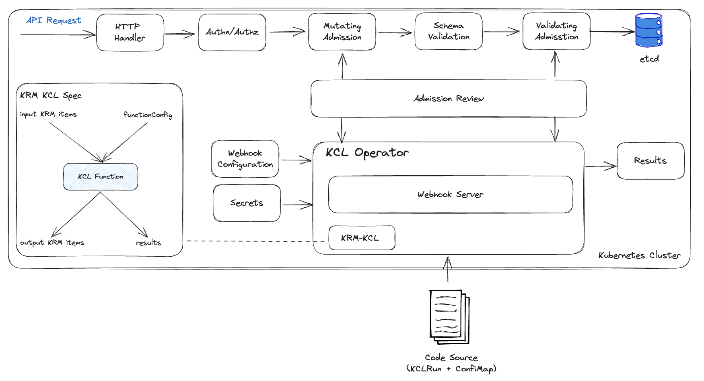

# KCL Operator

[](https://goreportcard.com/report/kcl-lang.io/kcl-operator)
[](https://godoc.org/kcl-lang.io/kcl-operator)
[](https://kcl-lang.io/kcl-operator/blob/main/LICENSE)

KCL Operator provides cluster integration, allowing you to use Access Webhook to generate, mutate, or validate resources based on KCL configuration when apply resources to the cluster. Webhook will capture creation, application, and editing operations, and execute [KCLRun](https://github.com/kcl-lang/krm-kcl) on the configuration associated with each operation, and the KCL programming language can be used to

+ Add labels or annotations based on a condition.
+ Inject a sidecar container in all KRM resources that contain a `PodTemplate`.
+ Validate all KRM resources using KCL schema.
+ Use an abstract model to generate KRM resources.

## Architecture



## Developing

+ Install Go 1.22+
+ Install Kubectl and Kustomize
+ Install [Operator SDK](https://sdk.operatorframework.io/)
+ Prepare a Kubernetes Cluster e.g., K3d

Run `make help` to get the help.

## Quick Start

1. Deploy the KCL Operator.

```shell
make deploy
```

Use the following command to watch and wait for the pod status is `Running`.

```shell
kubectl get po
```

2. Deploy the KCL source

```shell
kubectl apply -f- << EOF
apiVersion: krm.kcl.dev/v1alpha1
kind: KCLRun
metadata:
  name: set-annotation
spec:
  params:
    annotations:
      managed-by: kcl-operator
  source: oci://ghcr.io/kcl-lang/set-annotation
EOF
```

3. Validate the mutation result by creating a nginx Pod YAML.

```shell
kubectl apply -f- << EOF
apiVersion: v1
kind: Pod
metadata:
  name: nginx
  annotations:
    app: nginx
spec:
  containers:
  - name: nginx
    image: nginx:1.14.2
    ports:
    - containerPort: 80
EOF
kubectl get po nginx -o yaml | grep kcl-operator
```

The output is

```shell
    managed-by: kcl-operator
```

We can find the annotation `managed-by=kcl-operator` is added on the pod.

## Guides for Developing KCL

Here's what you can do in the KCL script:

+ Read resources from `option("resource_list")`. The `option("resource_list")` complies with the [KRM Functions Specification](https://github.com/kubernetes-sigs/kustomize/blob/master/cmd/config/docs/api-conventions/functions-spec.md#krm-functions-specification). You can read the input resources from `option("items")` and the `params` from `option("params")`.
+ Return a KRM list for output resources.
+ Return an error using `assert {condition}, {error_message}`.
+ Read the environment variables. e.g. `option("PATH")` (**Not yet implemented**).
+ Read the OpenAPI schema. e.g. `option("open_api")["definitions"]["io.k8s.api.apps.v1.Deployment"]` (**Not yet implemented**).

## Library

You can directly use [KCL standard libraries](https://kcl-lang.io/docs/reference/model/overview) such as `regex.match`, `math.log`.

## Tutorial

See [here](https://kcl-lang.io/docs/reference/lang/tour) to study more features of KCL.

## Examples

See [here](https://github.com/kcl-lang/krm-kcl/tree/main/examples) for more examples.
